### 创建你的第一个应用:

`package.json`:

```json
{
  "name": "my-electron-app",
  "version": "1.0.0",
  "description": "my demo",
  "main": "main.js",
  "scripts": {
    "dev": "electron .  --inspect=5858",
    "start": "electron-forge start",
    "package": "electron-forge package",
    "make": "electron-forge make",
    "win": "electron-builder --win --x64"
  },
  "author": "icestone",
  "license": "MIT",
  "devDependencies": {
    "@electron-forge/cli": "^6.1.1",
    "electron": "23.1.3",
    "electron-builder": "^23.6.0"
  },
  "win": {
    "icon": "icons/icon.ico",
    "target": [
      {
        "target": "nsis",
        "arch": [
          "x64",
          "ia32"
        ]
      }
    ]
  }
}
```

`main.js`

```javascript
const path = require('path');
const {app, BrowserWindow, ipcMain} = require('electron');

const createWindow = () => {
    const win = new BrowserWindow({
        width: 1000,
        height: 900,
        webPreferences: {
            preload: path.join(__dirname, './preload.js'),
        },
    })
    require('./src/js/menu'),
    ipcMain.handle('ping', () => 'pong');
    win.loadFile('index.html');
}


// 下面两种监听都可以
/*app.whenReady().then(() => {
    createWindow()
})*/
app.on('ready', () => {
    createWindow()
})

//  监听关闭时调用
app.on('window-all-closed', () => {
    console.log('close window')
    if (process.platform !== 'darwin') app.quit()
})
```

`index.html`:

```html
<!DOCTYPE html>
<html>
<head>
    <meta charset="UTF-8">
    <title>Hello World!</title>
    <meta http-equiv="Content-Security-Policy" content="script-src 'self' 'unsafe-inline';" />
</head>
<body>
<h1>Hello World!</h1>
<p>
    We are using Node.js <span id="node-version"></span>,
    Chromium <span id="chrome-version"></span>,
    and Electron <span id="electron-version"></span>.
</p>
</body>
</html>
```

run:

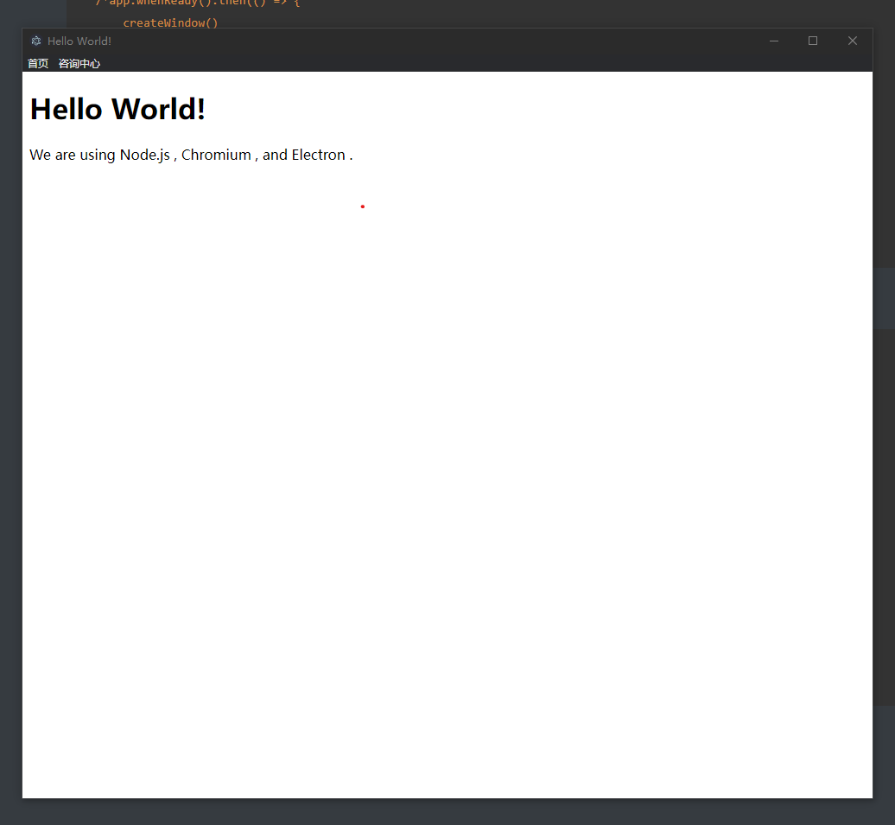

#### 监听一个窗口的关闭:

```javascript
    win.on('close',function () {
        console.log('window is close!')
    })
```

它的完整代码应该是:

```javascript
const path = require('path');
const {app, BrowserWindow, ipcMain} = require('electron');

const createWindow = () => {
    const win = new BrowserWindow({
        width: 1000,
        height: 900,
        webPreferences: {
            preload: path.join(__dirname, './preload.js'),
        },
    })
    ipcMain.handle('ping', () => 'pong');
    win.loadFile('index.html');
    win.on('close',function () {
        console.log('window is close!')
    })
}


// 下面两种监听都可以
/*app.whenReady().then(() => {
    createWindow()
})*/
app.on('ready', () => {
    createWindow()
})

//  监听关闭时调用
app.on('window-all-closed', () => {
    console.log('close window')
    if (process.platform !== 'darwin') app.quit()
})
```

### electron的生命周期

#### 生命周期事件:

- ready
  - app初始化完成时调用一次
- dom-ready
  - 一个窗口中的文本加载完成,此时可以执行dom操作
- did-finsh-load
  - 导航完成时触发
- window-all-closed
  - 所有窗口都被关闭时触发

- before-quit
  - 在关闭窗口之前触发
- will-quit
  - 在窗口关闭并且应用退出时触发
- quit
  - 当所有窗口被关闭时触发

- closed
  - 当所有窗口关闭时触发,此时应删除窗口引用

例如下面的main.js演示:

```javascript
const path = require('path');
const {app, BrowserWindow, ipcMain} = require('electron');

const createWindow = () => {
    const win = new BrowserWindow({
        width: 1000,
        height: 900,
        webPreferences: {
            preload: path.join(__dirname, './preload.js'),
        },
    })
    ipcMain.handle('ping', () => 'pong');
    win.loadFile('index.html');

    win.webContents.on('did-finish-load', () => {
        console.log('did-finish-load');
    })
    win.webContents.on('dom-ready', () => {
        console.log('dom-ready');
    })

    win.on('close', function () {
        console.log('close')
    })
}


// 下面两种监听都可以
/*app.whenReady().then(() => {
    createWindow()
})*/
app.on('ready', () => {
    console.log('ready')
    createWindow()
});
//  监听关闭时调用
app.on('window-all-closed', () => {
    console.log('all close window')
    if (process.platform !== 'darwin') app.quit()
});
app.on('before-quit', function () {
    console.log('before-quit')
});
app.on('will-quit', function () {
    console.log('will-quit');
});
app.on('quit', function () {
    console.log('quit');
});
```

run:

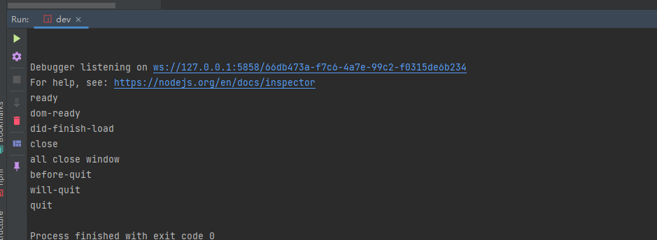

### 窗口尺寸设置

#### 使用nodemon

`package.json中的script:`

```json
  "scripts": {
    "dev": "electron .  --inspect=5858",
    "start": "electron .",
    "nodemon": "nodemon --main.js --exec npm run dev"
  },
```

这样就可以使用nodemon监听main.js的改动了

#### 相关属性

每次打开窗口默认会在屏幕的中央进行显示,如果想要更改,可以在mian.js中使用`x`,`y`来更改:

```javascript
const path = require('path');
const {app, BrowserWindow, ipcMain} = require('electron');

const createWindow = () => {
    const win = new BrowserWindow({
        x: 200,
        y: 200,
        width: 1000,
        height: 900,
        webPreferences: {
            preload: path.join(__dirname, './preload.js'),
        },
    })
    ipcMain.handle('ping', () => 'pong');
    win.loadFile('index.html');

    win.webContents.on('did-finish-load', () => {
        console.log('did-finish-load');
    })
    win.webContents.on('dom-ready', () => {
        console.log('dom-ready');
    })

    win.on('close', function () {
        console.log('close')
    })
}

// 下面两种监听都可以
/*app.whenReady().then(() => {
    createWindow()
})*/
app.on('ready', () => {
    console.log('ready')
    createWindow()
});
//  监听关闭时调用
app.on('window-all-closed', () => {
    console.log('all close window')
    if (process.platform !== 'darwin') app.quit()
});
app.on('before-quit', function () {
    console.log('before-quit')
});
app.on('will-quit', function () {
    console.log('will-quit');
});
app.on('quit', function () {
    console.log('quit');
});
```

然后他就更改了:

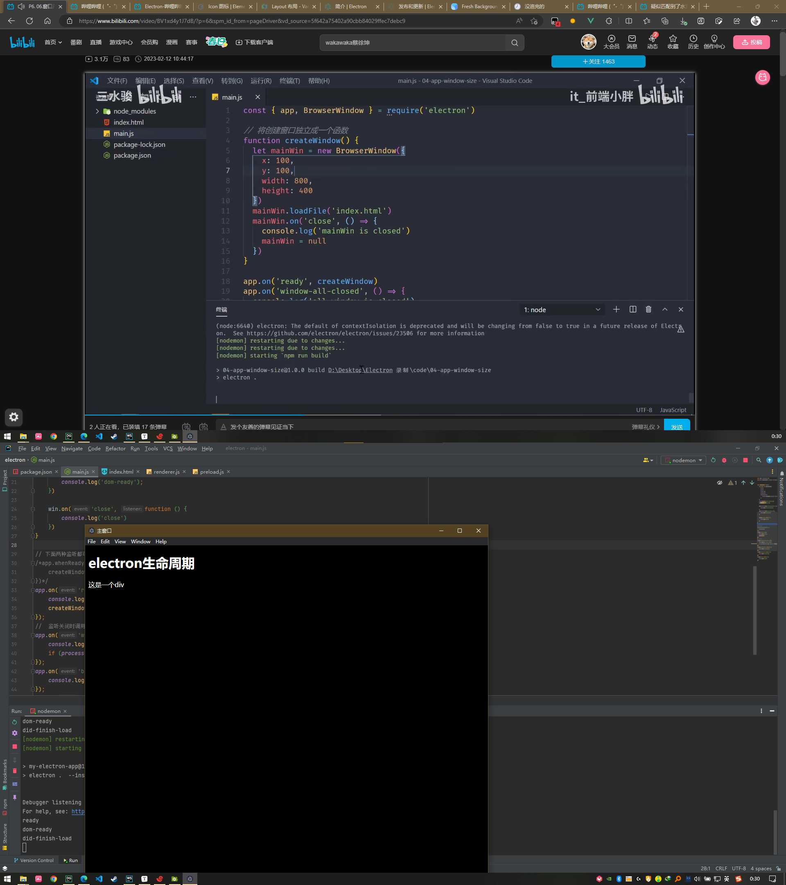

但是此时,可能会先出现窗口,白屏一瞬间之后再加载内容,那么此时就可以使用:`show: false`设置一下

```javascript
const win = new BrowserWindow({
        show: false,
        x: 200,
        y: 200,
        width: 1000,
        height: 900,
        webPreferences: {
            preload: path.join(__dirname, './preload.js'),
        },
    })
    win.on("ready-to-show", function () {
        win.loadFile('index.html');
    })
```

这里监听了`ready-to-show`,在这个阶段才调用加载`index.html`

#### 设置最大,最小尺寸

```javascript
const win = new BrowserWindow({
        show: false,
        x: 200,
        y: 200,
        width: 1000,
        height: 900,
        maxHeight: 1000,
        maxWidth: 1100,
        minHeight: 500,
        minWidth: 1000
    })
```

#### 固定尺寸

使用`resizable:false`:

```javascript
const win = new BrowserWindow({
        show: false,
        x: 200,
        y: 200,
        width: 1000,
        height: 900,
        maxHeight: 1000,
        maxWidth: 1100,
        minHeight: 500,
        minWidth: 1000,
        resizable:false
    })
```

#### main设置界面内容

#### 设置title

```javascript
const win = new BrowserWindow({
        // show: false,
        x: 200,
        y: 200,
        width: 1000,
        height: 900,
        // 设置最大尺寸
        maxHeight: 1000,
        maxWidth: 1100,
        // 设置最小尺寸
        minHeight: 500,
        minWidth: 1000,
        // 禁止缩放窗口
        // resizable:false
        title:'在main.js中设置的title'
    })
```

- 注意,此时在index.html的title应该为空

##### 设置icon

```javascript
const win = new BrowserWindow({
        // show: false,
        x: 200,
        y: 200,
        width: 1000,
        height: 900,
        // 设置最大尺寸
        maxHeight: 1000,
        maxWidth: 1100,
        // 设置最小尺寸
        minHeight: 500,
        minWidth: 1000,
        // 禁止缩放窗口
        // resizable:false
        title:'在main.js中设置的title',
        icon:'./lg.ico'
    })
```

如图:

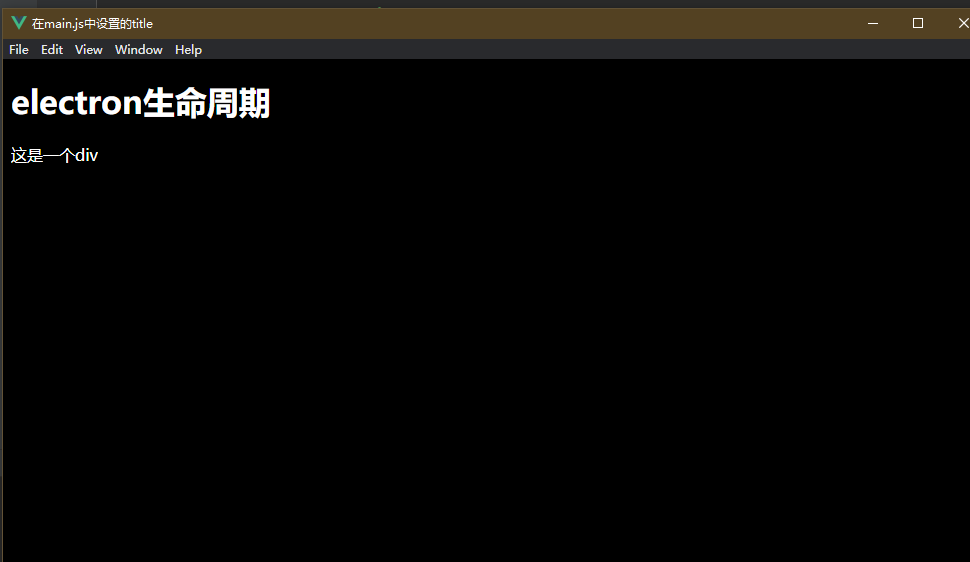

##### 不显示默认的窗口和菜单

`frame:false`,默认为true

运行:

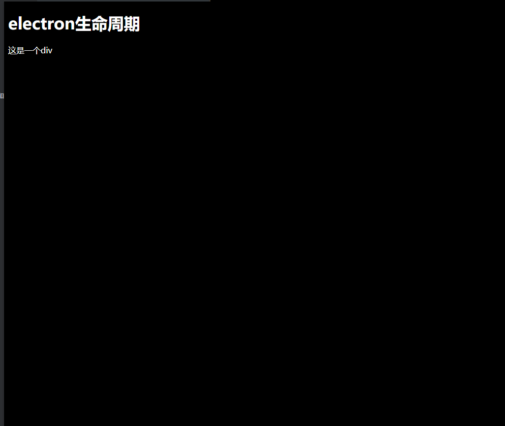

那么此时窗口无法进行拖动

##### 透明窗体

`transparent: true`

运行:

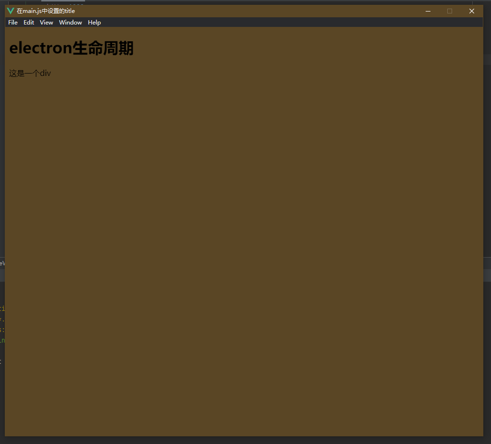

##### 隐藏menu

````javascript
const win = new BrowserWindow({
        // show: false,
        x: 200,
        y: 200,
        width: 1000,
        height: 900,
        // 设置最大尺寸
        maxHeight: 1000,
        maxWidth: 1100,
        // 设置最小尺寸
        minHeight: 500,
        minWidth: 1000,
        // 禁止缩放窗口
        // resizable:false
        title: '在main.js中设置的title',
        icon: './lg.ico',
        // 不显示默认窗口和菜单
        // frame:false
        // 透明窗体
        // transparent: true
        // 隐藏menu
        autoHideMenuBar: true
    })
````


#### 调试面板

ctrl+shift+i

#### 允许渲染进程和nodejs交互

一般情况下,在`index.html`中引用的js文件是无法导入nodejs中的包的,例如下面的代码:

`index.js`:

```javascript
const o=require('electron');

// dom加载完之后执行
window.addEventListener('DOMContentLoaded', function () {
// 点击打开一个新窗口
    const oBtn=document.getElementById('btn')
    oBtn.addEventListener('click',()=>{
    })
})
```

在第一行导入了包,那么在应用的控制台中:

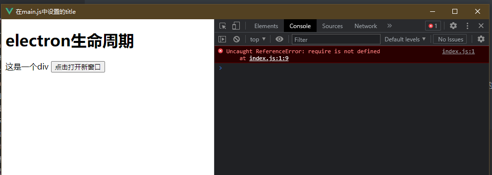

默认情况下是不允许渲染进程中的js直接和nodejs进行交互,那么在开发中想要和nodejs进行交互,可以在main.js中开启:

```javascript
webPreferences: {
            nodeIntegration: true,
            contextIsolation: false
        }
```

完整的main.js:

```javascript
const path = require('path');
const {app, BrowserWindow, ipcMain} = require('electron');

const createWindow = () => {
    const win = new BrowserWindow({
        x: 200,
        y: 200,
        width: 1000,
        height: 900,
        title: '在main.js中设置的title',
        icon: './lg.ico',
        autoHideMenuBar: true,
        webPreferences: {
            nodeIntegration: true,
            contextIsolation: false
        }
    })
    win.loadFile('index.html');
}

//  监听关闭时调用
app.on('window-all-closed', () => {
    console.log('all close window')
    if (process.platform !== 'darwin') app.quit()
});
```

然后就不会报错了

#### 渲染进程中不可以使用主进程的一些对象

例如像下面,在渲染进程中使用了`BrowserWindow`,虽然可以导入,但是不被允许:

```javascript
// BrowserWindow 是个主进程,虽然可以导入,但是在渲染进程中是不允许这样做的
const {BrowserWindow} = require('electron');
// dom加载完之后执行
window.addEventListener('DOMContentLoaded', function () {
// 点击打开一个新窗口
    const oBtn = document.getElementById('btn')
    oBtn.addEventListener('click', () => {
        let indexMin = new BrowserWindow({
            width: 1000,
            height: 900
        })
        indexMin.loadFile('../views/list.html');
        indexMin.on("close", () => {
            indexMin = null;
        })
    })
})
```

报错:

```shell
index.js:8 Uncaught TypeError: BrowserWindow is not a constructor
    at HTMLButtonElement.<anonymous> (index.js:8:24)
```

#### 使用remote让渲染进程使用BrowserWindow

main.js中的主要代码:

```javascript
const remote = require("@electron/remote/main") //1
remote.initialize()//2
remote.enable(win.webContents)//3
```

`mian.js`的完整代码:

```javascript
const {app, BrowserWindow} = require('electron');
const remote = require("@electron/remote/main") //1
remote.initialize()//2

const createWindow = () => {
    const win = new BrowserWindow({
        x: 200,
        y: 200,
        width: 1000,
        height: 900,
        title: '在main.js中设置的title',
        icon: './lg.ico',
        autoHideMenuBar: true,
        webPreferences: {
            nodeIntegration: true,
            contextIsolation: false
        },
    })
    win.loadFile('index.html');
    remote.enable(win.webContents)//3
}

app.on('ready', () => {
    console.log('ready')
    createWindow()
});
//  监听关闭时调用
app.on('window-all-closed', () => {
    console.log('all close window')
    if (process.platform !== 'darwin') app.quit()
});
```

`index.js`:

```javascript
// BrowserWindow 是个主进程,虽然可以导入,但是在渲染进程中是不允许这样做的
const {BrowserWindow} = require("@electron/remote");
console.log('当前路径')
console.log(__dirname)
// dom加载完之后执行
window.addEventListener('DOMContentLoaded', function () {
// 点击打开一个新窗口
    const oBtn = document.getElementById('btn')
    oBtn.addEventListener('click', () => {
        let indexMin = new BrowserWindow({
            width: 1000,
            height: 900
        })
        indexMin.loadFile('./src/views/list.html');
        indexMin.on("close", () => {
            indexMin = null;
        })
    })
})
```

要注意这里的引用:

```javascript
const {BrowserWindow} = require("@electron/remote");
```

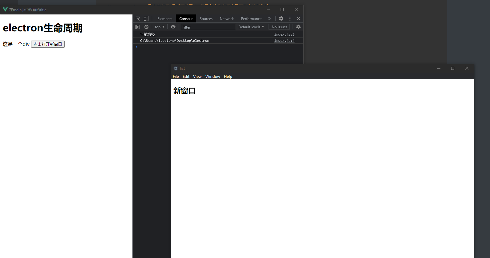

#### 自定义窗口的实现

##### 最小化,最大化,关闭的实现:

`index.html`:

```html
<!DOCTYPE html>
<html>
<head>
    <meta charset="UTF-8">
    <!-- https://developer.mozilla.org/zh-CN/docs/Web/HTTP/CSP -->
    <meta http-equiv="Content-Security-Policy" content="default-src 'self'; script-src 'self'">
    <title></title>
    <!--    <link rel="stylesheet/less" type="text/less" href="./src/css/index.less"/>-->
    <link rel="stylesheet" type="text/css" href="./src/css/index.css"/>
</head>
<body>
<div class="container">
    <div class="header">
        <div  class="btn">minWindow</div>
        <div class="btn">maxWindow</div>
        <div class="btn">close</div>
    </div>

</div>

<script src="./index.js"></script>

</body>
</html>
```

`index.js`:

```javascript
// BrowserWindow 是个主进程,虽然可以导入,但是在渲染进程中是不允许这样做的
const {BrowserWindow, ipcMain, getCurrentWindow} = require("@electron/remote");
let mainWin = getCurrentWindow();

console.log('当前路径')
console.log(__dirname)
// dom加载完之后执行
window.addEventListener('DOMContentLoaded', function () {
// 点击打开一个新窗口
    const btns = document.getElementsByClassName('btn')
    const close = btns[2];
    const maxWindow = btns[1];
    const minWindow = btns[0];

    close.addEventListener('click', () => {
        console.log('关闭')
        mainWin.close();
    })
    maxWindow.addEventListener('click', () => {
        console.log('最大化')
        /*        console.log('是否为最大化')
                console.log(mainWin.isMaximizable());*/
        if (!mainWin.isMaximized()) {
            mainWin.maximize()
        } else {
            console.log('恢复尺寸')
            // 让当前窗口回到原始状态
            mainWin.restore();
        }
    })
    minWindow.addEventListener('click', () => {
        console.log('最小化')
        if (!mainWin.isMinimized()) {
            mainWin.minimize()
        } else {
            mainWin.restore();
        }
    })
})
```

##### 阻止窗口关闭

监听窗口关闭之前的状态:

`index.js`:

```javascript
// BrowserWindow 是个主进程,虽然可以导入,但是在渲染进程中是不允许这样做的
const {BrowserWindow, ipcMain, getCurrentWindow} = require("@electron/remote");
let mainWin = getCurrentWindow();

console.log('当前路径')
console.log(__dirname)
// dom加载完之后执行
window.addEventListener('DOMContentLoaded', function () {
    window.onbeforeunload = function () {
        console.log('关闭窗口')
        return false;
    }

// 点击打开一个新窗口
    const btns = document.getElementsByClassName('btn')
    const close = btns[2];
    const maxWindow = btns[1];
    const minWindow = btns[0];

    close.addEventListener('click', () => {
        console.log('关闭')
        mainWin.close();
    })
    maxWindow.addEventListener('click', () => {
        console.log('最大化')
        /*console.log('是否为最大化')
                console.log(mainWin.isMaximizable());*/
        if (!mainWin.isMaximized()) {
            mainWin.maximize()
        } else {
            console.log('恢复尺寸')
            // 让当前窗口回到原始状态
            mainWin.restore();
        }
    })
    minWindow.addEventListener('click', () => {
        console.log('最小化')
        if (!mainWin.isMinimized()) {
            mainWin.minimize()
        } else {
            mainWin.restore();
        }
    })
})
```

`index.html`:

```html
<!DOCTYPE html>
<html>
<head>
    <meta charset="UTF-8">
    <meta http-equiv="Content-Security-Policy" content="default-src 'self'; script-src 'self'">
    <title></title>
    <link rel="stylesheet" type="text/css" href="./src/css/index.css"/>
</head>
<body>
<div class="container">
    <div class="header">
        <div class="btn">minWindow</div>
        <div class="btn">maxWindow</div>
        <div class="btn">close</div>
    </div>

</div>
<div class="alert">
    确认关闭?
    <button class="close">yes!</button>
    <button class="notClose">no!</button>
</div>
<script src="./index.js"></script>
</body>
</html>
```

这里主要是`index.js`中的:

```javascript
    window.onbeforeunload = function () {
        console.log('关闭窗口')
        return false;
    }
```

##### 弹窗控制窗口关闭与否:

`index.html`:

```html
<!DOCTYPE html>
<html>
<head>
    <meta charset="UTF-8">
    <meta http-equiv="Content-Security-Policy" content="default-src 'self'; script-src 'self'">
    <title></title>
    <link rel="stylesheet" type="text/css" href="./src/css/index.css"/>
</head>
<body>
<div class="container">
    <div class="header">
        <div class="btn">minWindow</div>
        <div class="btn">maxWindow</div>
        <div class="btn">close</div>
    </div>
</div>
<div class="alert">
    确认关闭?
    <button class="close">yes!</button>
    <button class="notClose">no!</button>
</div>
<script src="./index.js"></script>
</body>
</html>
```

`index.css`:

```css
.container {
    display: flex;
    flex-direction: column;
}
.header {
    display: flex;
    width: 100%;
    flex-direction: row;
    justify-content: end;
    background: #8c8c73;
}
.header div {
    padding-right: 20px;
}
body {
    background-image: linear-gradient(to top, #cfd9df 0%, #e2ebf0 100%);
}
.alert{
    display: none;
}
```

`index.js`:

```javascript
// BrowserWindow 是个主进程,虽然可以导入,但是在渲染进程中是不允许这样做的
const {BrowserWindow, ipcMain, getCurrentWindow} = require("@electron/remote");
let mainWin = getCurrentWindow();

console.log('当前路径')
console.log(__dirname)
// dom加载完之后执行
window.addEventListener('DOMContentLoaded', function () {
    window.onbeforeunload = function () {
        console.log('关闭窗口')
        const alert = document.getElementsByClassName('alert')[0];
        alert.style.display = 'flex';
        const yesBtn = document.getElementsByClassName('close')[0];
        const noBtn = document.getElementsByClassName('notClose')[0];
        yesBtn.addEventListener('click', () => {
            mainWin.destroy();
        })
        noBtn.addEventListener('click', () => {
            alert.style.display = 'none';
        })
        return false;
    }

// 点击打开一个新窗口
    const btns = document.getElementsByClassName('btn')
    const close = btns[2];
    const maxWindow = btns[1];
    const minWindow = btns[0];

    close.addEventListener('click', () => {
        console.log('关闭')
        mainWin.close();
    })
    maxWindow.addEventListener('click', () => {
        console.log('最大化')
        /*console.log('是否为最大化')
                console.log(mainWin.isMaximizable());*/
        if (!mainWin.isMaximized()) {
            mainWin.maximize()
        } else {
            console.log('恢复尺寸')
            // 让当前窗口回到原始状态
            mainWin.restore();
        }
    })
    minWindow.addEventListener('click', () => {
        console.log('最小化')
        if (!mainWin.isMinimized()) {
            mainWin.minimize()
        } else {
            mainWin.restore();
        }
    })
})
```

`main.js`:

```javascript
const {app, BrowserWindow} = require('electron')
const path = require('path')
const remote = require("@electron/remote/main") //1
remote.initialize()//2
const createWindow = () => {
    const win = new BrowserWindow({
        width: 800,
        height: 600,
        frame: false,
        webPreferences: {
            nodeIntegration: true,
            contextIsolation: false
        }
    })
    win.loadFile('index.html')
    win.on('close', function () {
        console.log('close')
    })
    remote.enable(win.webContents)//3
}
app.whenReady().then(() => {
    createWindow()
    app.on('activate', () => {
        if (BrowserWindow.getAllWindows().length === 0) createWindow()
    })
})
app.on('window-all-closed', () => {
    if (process.platform !== 'darwin') app.quit()
})
```

#### 父子及模态窗口

> 一般情况下创建的子窗口,在操作子窗口时,父窗口依旧可以操作:

`main.js`:

```javascript
const {app, BrowserWindow} = require('electron')
//1
const remote = require("@electron/remote/main")
//2
remote.initialize()

const createWindow = () => {
    // 创建浏览窗口
    const win = new BrowserWindow({
        width: 800,
        height: 600,
        title: '子窗口及模态窗口',
        webPreferences: {
            nodeIntegration: true,
            contextIsolation: false
        }
    })

    // 加载 index.html
    win.loadFile('index.html')
    //3
    remote.enable(win.webContents)

    // 打开开发工具
    // mainWindow.webContents.openDevTools()
}

// 这段程序将会在 Electron 结束初始化
// 和创建浏览器窗口的时候调用
// 部分 API 在 ready 事件触发后才能使用。
app.whenReady().then(() => {
    createWindow()
    app.on('activate', () => {
        // 在 macOS 系统内, 如果没有已开启的应用窗口
        // 点击托盘图标时通常会重新创建一个新窗口
        if (BrowserWindow.getAllWindows().length === 0) createWindow()
    })
})

app.on('window-all-closed', () => {
    if (process.platform !== 'darwin') app.quit()
})
```

`index.html`:

```html
<!--index.html-->
<!DOCTYPE html>
<html>
<head>
    <meta charset="UTF-8">
    <meta http-equiv="Content-Security-Policy" content="default-src 'self'; script-src 'self'">
    <title></title>
</head>
<body>

<div class="container">
<button id="btn">新增窗口</button>

</div>
<script src="./index.js"></script>
</body>
</html>
```

`index.js`:

```javascript
const {BrowserWindow, getCurrentWindow} = require("@electron/remote");
let mainWin = getCurrentWindow();
window.addEventListener('DOMContentLoaded', () => {
    const btn = document.getElementById("btn");
    btn.addEventListener('click', () => {
        let subWin = new BrowserWindow({
            parent: mainWin,
            width: 1000,
            height: 900
        })
        subWin.loadFile('sub.html')
        subWin.on('close', () => {
            subWin = null;
        })
    })
})
```

run:

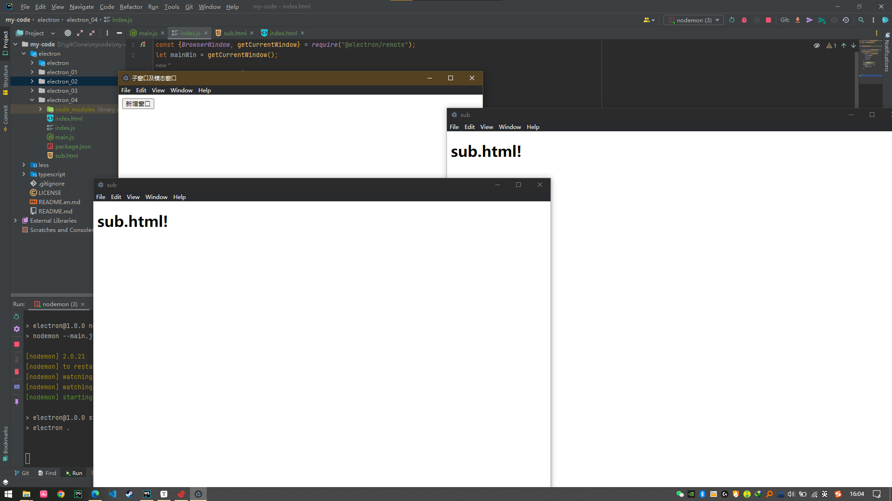

此时是可以拖动父窗口的

但是使用模态窗口就可以避免这个问题,

> 模态窗口

`main.js`:

```javascript
const {app, BrowserWindow} = require('electron')
//1
const remote = require("@electron/remote/main")
//2
remote.initialize()

const createWindow = () => {
    // 创建浏览窗口
    const win = new BrowserWindow({
        width: 800,
        height: 600,
        title: '子窗口及模态窗口',
        webPreferences: {
            nodeIntegration: true,
            contextIsolation: false
        }
    })

    // 加载 index.html
    win.loadFile('index.html')
    //3
    remote.enable(win.webContents)

    // 打开开发工具
    // mainWindow.webContents.openDevTools()
}

// 这段程序将会在 Electron 结束初始化
// 和创建浏览器窗口的时候调用
// 部分 API 在 ready 事件触发后才能使用。
app.whenReady().then(() => {
    createWindow()
    app.on('activate', () => {
        // 在 macOS 系统内, 如果没有已开启的应用窗口
        // 点击托盘图标时通常会重新创建一个新窗口
        if (BrowserWindow.getAllWindows().length === 0) createWindow()
    })
})
app.on('window-all-closed', () => {
    if (process.platform !== 'darwin') app.quit()
})
```

`index.html`:

```html
<!--index.html-->
<!DOCTYPE html>
<html>
<head>
    <meta charset="UTF-8">
    <meta http-equiv="Content-Security-Policy" content="default-src 'self'; script-src 'self'">
    <title></title>
</head>
<body>

<div class="container">
<button id="btn">新增窗口</button>

</div>
<script src="./index.js"></script>
</body>
</html>
```

`index.js`:

```javascript
const {BrowserWindow, getCurrentWindow} = require("@electron/remote");
let mainWin = getCurrentWindow();
window.addEventListener('DOMContentLoaded', () => {

    const btn = document.getElementById("btn");
    btn.addEventListener('click', () => {
        let subWin = new BrowserWindow({
            parent: mainWin,
            width: 1000,
            height: 900,
            modal: true
        })
        subWin.loadFile('sub.html')
        subWin.on('close', () => {
            subWin = null;
        })
    })
})
```

run:

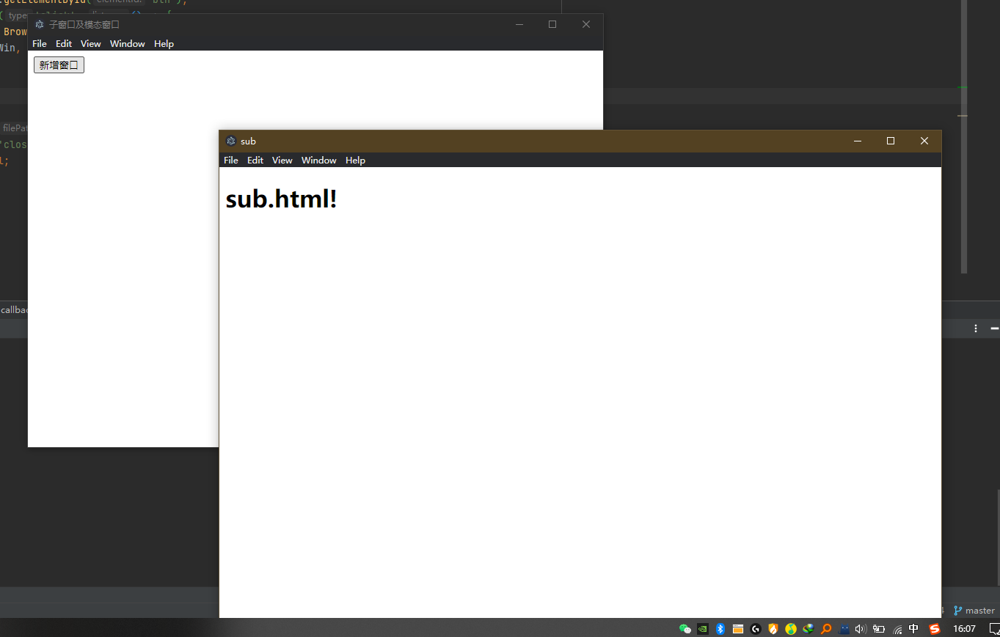

注意,这里主要起作用的是`index.js`的:

```javascript
modal: true
```

#### 自定义菜单

##### 自定义一个简单的菜单

```javascript
const {app, BrowserWindow, Menu} = require('electron')
//1
const remote = require("@electron/remote/main")
//2
remote.initialize()
const createWindow = () => {
    // 创建浏览窗口
    const win = new BrowserWindow({
        width: 800,
        height: 600,
        title: '自定义菜单',
        webPreferences: {
            nodeIntegration: true,
            contextIsolation: false
        }
    })
    // 1.定义自己需要的菜单
	let menuMap = [
         {label: '文件'},
         {label: '编辑'},
     ];
    // 2.利用上面的模板构建菜单项:
    let menu = Menu.buildFromTemplate(menuMap);
    // 3.将上述的自定义菜单添加到应用
    Menu.setApplicationMenu(menu);
    win.loadFile('index.html')
    //3
    remote.enable(win.webContents)
}
app.whenReady().then(() => {
    createWindow()
    app.on('activate', () => {
        if (BrowserWindow.getAllWindows().length === 0) createWindow()
    })
})
app.on('window-all-closed', () => {
    if (process.platform !== 'darwin') app.quit()
})
```

主要分三步:

- 定义你的菜单,数组,需要在之前引入Menu:`const {app, BrowserWindow, Menu} = require('electron')`

```javascript
// 1.定义自己需要的菜单
let menuMap = [
     {label: '文件'},
     {label: '编辑'},
];
```

- 利用上面的模板构建菜单项:

```javascript
let menu = Menu.buildFromTemplate(menuMap);
```

- 将上述的自定义菜单添加到应用

```javascript
// 3.将上述的自定义菜单添加到应用
Menu.setApplicationMenu(menu);
win.loadFile('index.html')
```

##### 菜单的点击以及二级菜单

```javascript
const {app, BrowserWindow, Menu} = require('electron')
//1
const remote = require("@electron/remote/main")
//2
remote.initialize()
const createWindow = () => {
    // 创建浏览窗口
    const win = new BrowserWindow({
        width: 800,
        height: 600,
        title: '自定义菜单',
        webPreferences: {
            nodeIntegration: true,
            contextIsolation: false
        }
    })
    // 1.定义自己需要的菜单
    let menuMap = [
        {
            label: '文件',
            submenu: [
                { 	
                    label: '打开文件夹',
                    click() {
                        console.log('open someone dir')
                    }
                },
                {
                    label: '打开文件'
                },
                {
                    label: '关于',
                    role: 'about'
                }
            ]
        },
        {label: '编辑'},
    ];
    // 2.利用上面的模板构建菜单项:
    let menu = Menu.buildFromTemplate(menuMap);
    // 3.将上述的自定义菜单添加到应用
    Menu.setApplicationMenu(menu);
    // 加载 index.html
    win.loadFile('index.html')
    //3
    remote.enable(win.webContents)
}
app.whenReady().then(() => {
    createWindow()
    app.on('activate', () => {
        if (BrowserWindow.getAllWindows().length === 0) createWindow()
    })
})

app.on('window-all-closed', () => {
    if (process.platform !== 'darwin') app.quit()
})

```

这里主要是`menuMap`发生变化,里面存储的`click`函数,在`文件`中定义的有其他的二级菜单

##### 定义菜单之间的分割线

```javascript
let menuMap = [
        {
            label: '文件',
            submenu: [
                {
                    label: '打开文件夹',
                    click() {
                        console.log('open someone dir')
                    }
                },
                // 分割线
                {
                    type: 'separator'
                },
                {
                    label: '打开文件',
                },
                {
                    label: '关于',
                    role: 'about'
                }
            ]
        },
        {label: '编辑'},
    ];
```

例如上面的,传入type`的值表示不同的分割线

#### 角色菜单以及类型

##### 菜单中的内置角色

```javascript
let menuMap = [  
    {  
        label: '内置角色',  
        submenu: [  
            {  
                label: '复制',  
                role: 'copy'  
            },  
            {  
                label: '剪贴',  
                role: 'cut'  
            },  
            {  
                label: '粘贴',  
                role: 'paste'  
            },  
            {  
                label: '最小化',  
                role: 'minimize'  
            }  
        ]  
    }];
```

##### 菜单中的选项卡:

```javascript
let menuMap = [   
    {  
        label: '类型',  
        submenu: [  
            {  
                label: '选项1',  
                type: 'checkbox'  
            },  
            {  
                label: '选项2',  
                type: 'checkbox'  
            },  
            {  
                label: '选项3',  
                type: 'checkbox'  
            },  
            {  
                type: 'separator'  
            },  
            {  
                label: 'item1',  
                type: 'radio'  
            },  
            {  
                label: 'item2',  
                type: 'radio'  
            },  
            {  
                type: 'separator'  
            },  
            {  
                label: 'windows',  
                type: 'submenu',  
                role: 'windowMenu'  
            }  
        ]  
    }]
```

##### 快捷键

```javascript
let menuMap =[
{  
    label: '其他',  
    submenu: [  
        {  
            label: '打开',  
            icon: './open.png',  
            accelerator: 'ctrl+o',  
            click() {  
                console.log('open操作执行了!')  
            }  
        },  
    ]  
}
]
```
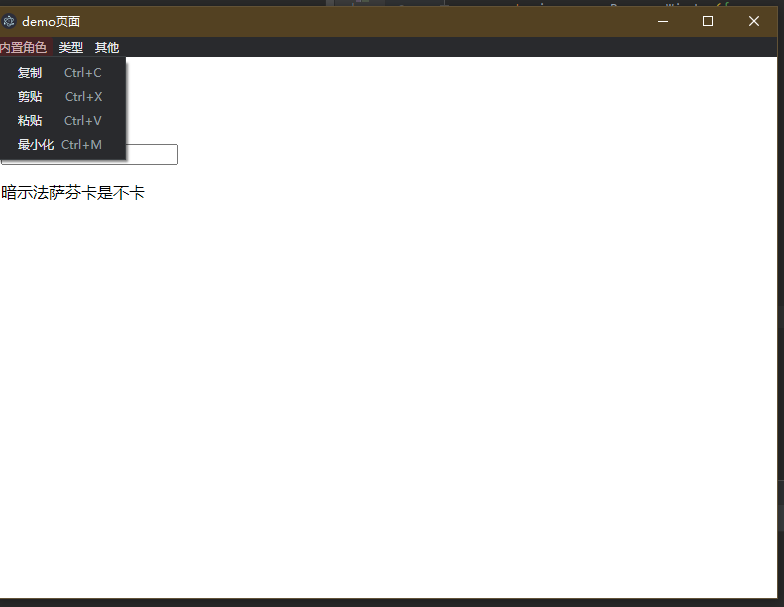
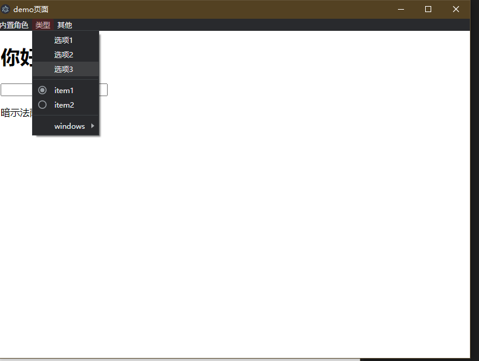
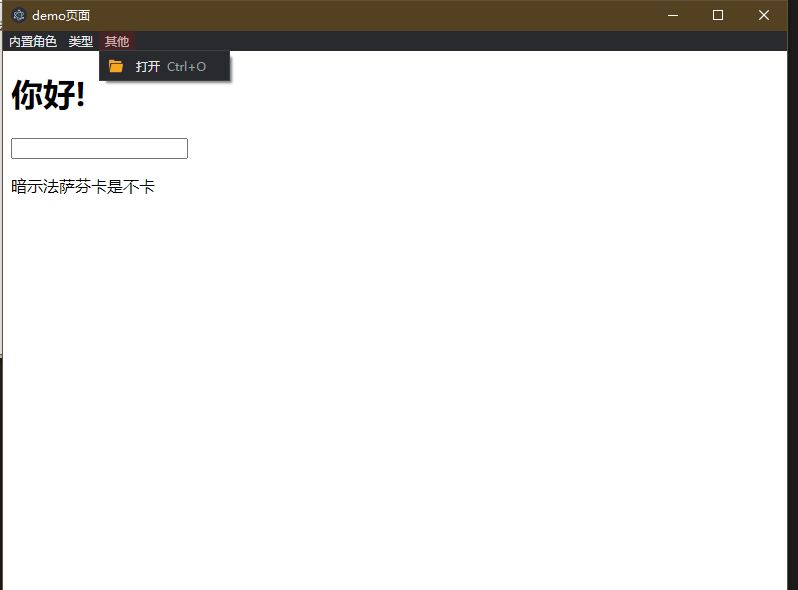
#### 动态创建菜单


